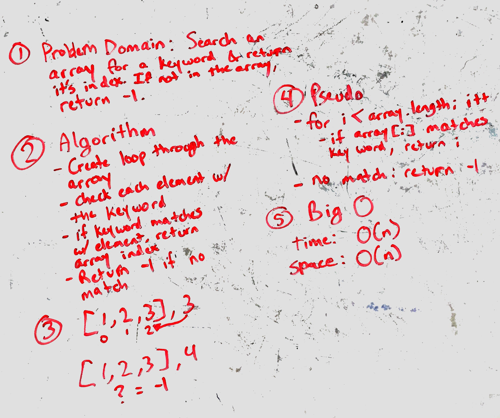

# Binary Search
Create a function called BinarySearch that takes a sorted array and a search key that will find the index of the search key value.

## Challenge
The function must return the index of the array element that matches the search key value.  If the value does not match an element within the array, it should return -1.

## Solution
