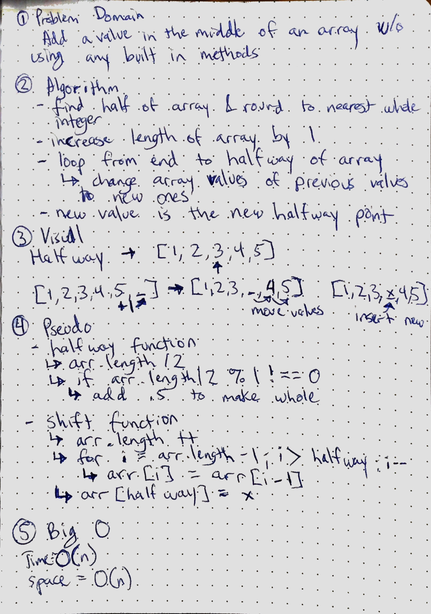

# Insert and shift middle index of array
Create a function called insertShiftarray that takes an array and adds a new value in the middle of the array.

## Challenge
The value must be added in the middle of the array without using any built in methods in javascript.

## Solution
