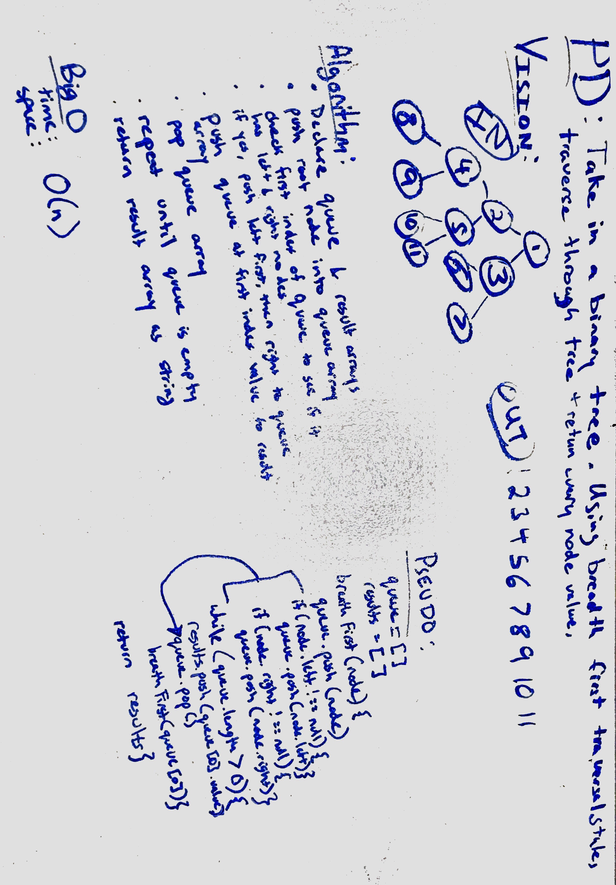

# Breadth First Traversal
Write a function that should return every node's value in a list.  Should go down one level of the tree and go from left to right.

## Challenge
- Traverse the tree in a specific order.
- push value into an array
- once all levels have been checked, return array

## Solution
