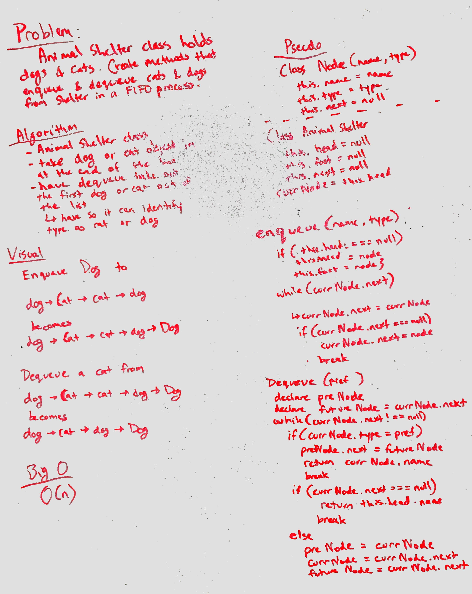

# FIFO Animal Shelter
Create an animal shelter class that follows the FIFO stucture for adding and removing cats and dogs from the list.  This should be able to determine the longest duration dog or cat from the list; otherwise it should return the first animal.

## Challenge
- add a dog or cat node to the end of the linked list.
- when removing, check each animal for a specified type of animal
- if no specified type matches, remove the very first animal in the list
- if an animal matches the desired type, remove that animal from the shelter

## Solution
