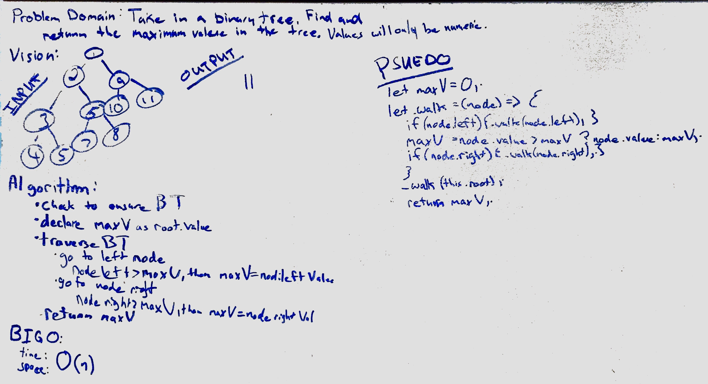

# Find Maximum Value
Create a function that finds the largest value in a binary tree.

## Challenge
- traverse through the tree
- save the root's value
- check the next value with the root's value
- if greater than saved value, replace and continue

## Solution
