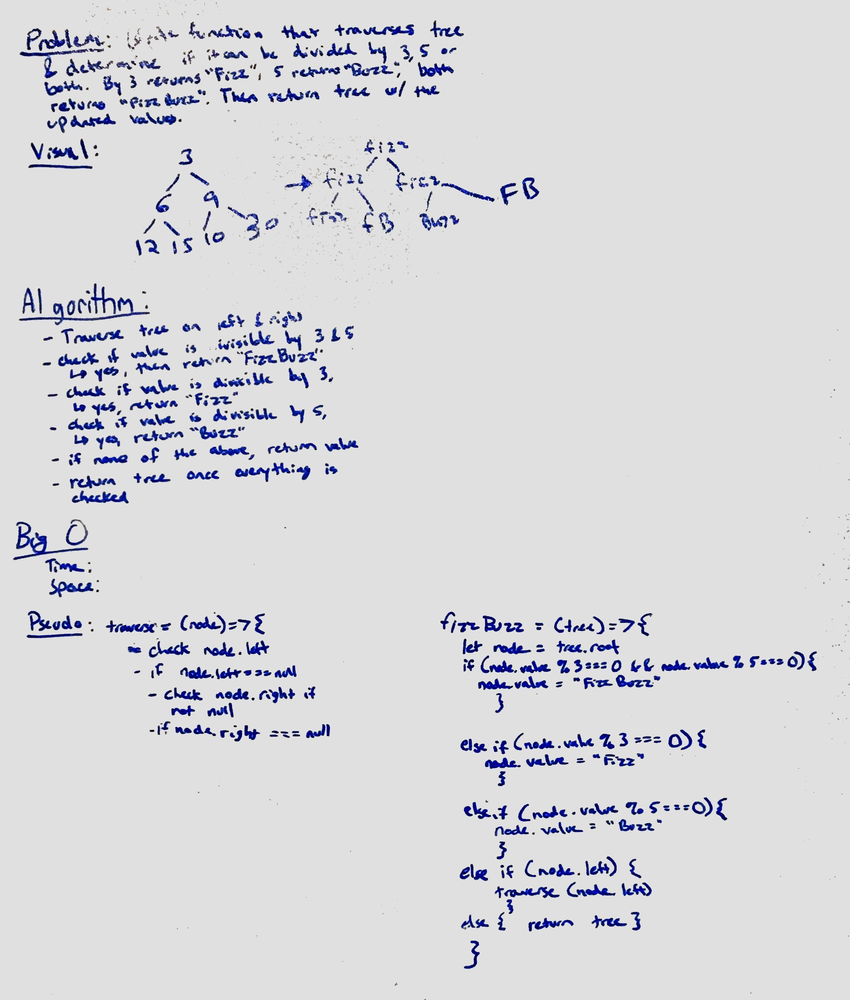

# Name of challenge
Make a function that changes the values of a binary tree depending on if the value is divisible by 3, 5, or both.
"fizz" if 3, "buzz" if 5, and "fizzbuzz" if both.

## Challenge
- Traverse the tree on both left and right.
- check each value to verify if it can be divided by 3 or 5 or both.
- change values depending on if it can be changed.

## Solution
