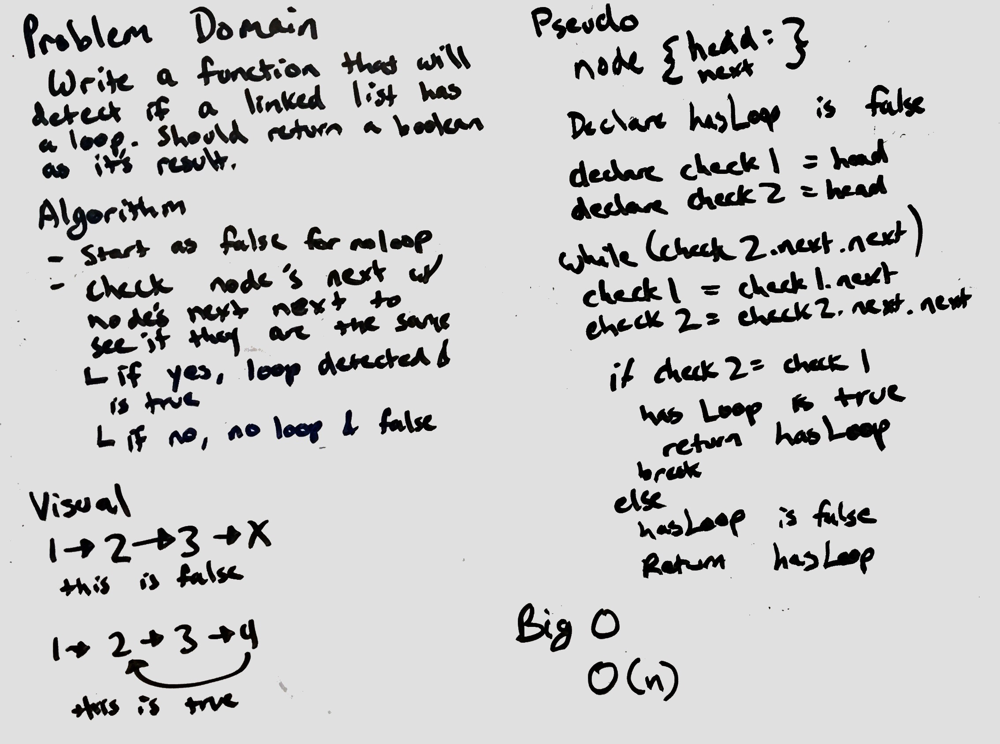

# Detect Loop in a Linked List
Create a function that will determine if a linked list has a loop.

## Challenge
- check node's next to see if it returns to an existing node.
- if it does, break the loop and return boolean response.

## Solution
