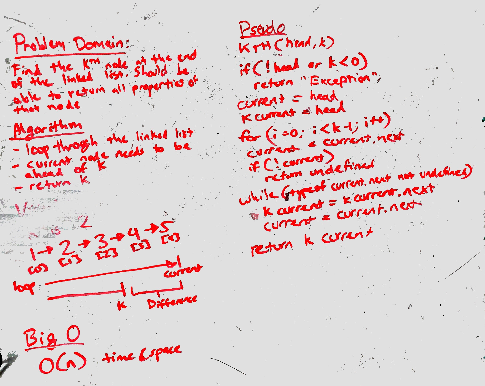

# kth from end of Linked List
Find the node at the kth position starting from the end of the linked list.

## Challenge
- start search from the end of the list
- go through the list until the position is reached.
  - if found, return the node
  - if not found, return 'exception'.

## Solution
