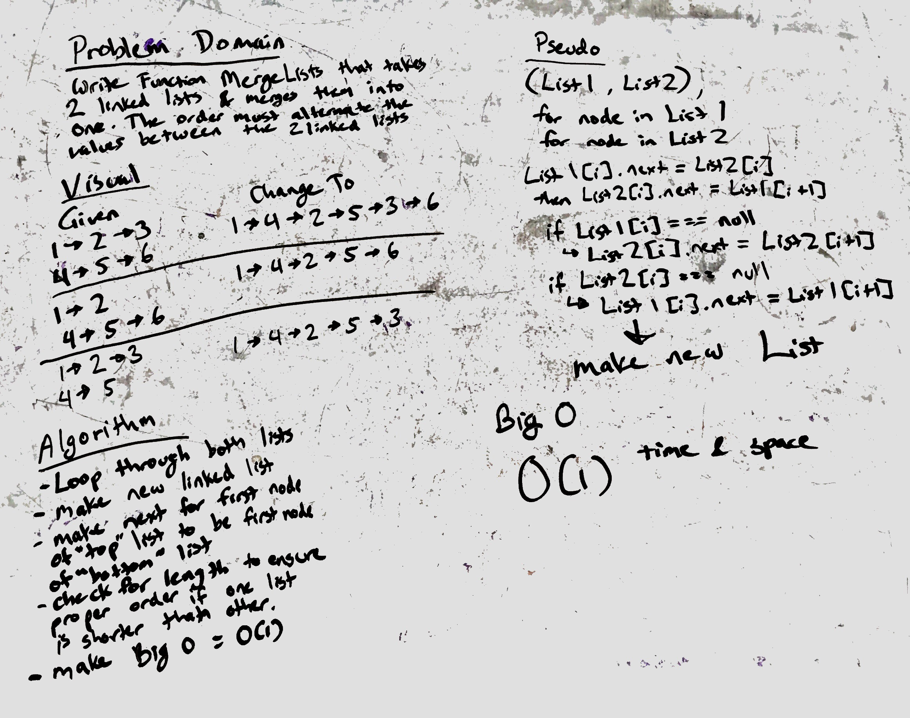

# LL merge
Create a function that will merge two linked lists in to one where each node alternate values between the two linked list.
IE:
1 > 2 > 3 > X
4 > 5 > 6 > X

should turn to

1 > 4 > 2 > 5 > 3 > 6 > X

## Challenge
- Create a new linked list
- have one linked list merge data from one to the other.  
- ensure it can check values between the 2
- continue to the next list if one is shorter than the other

## Solution
