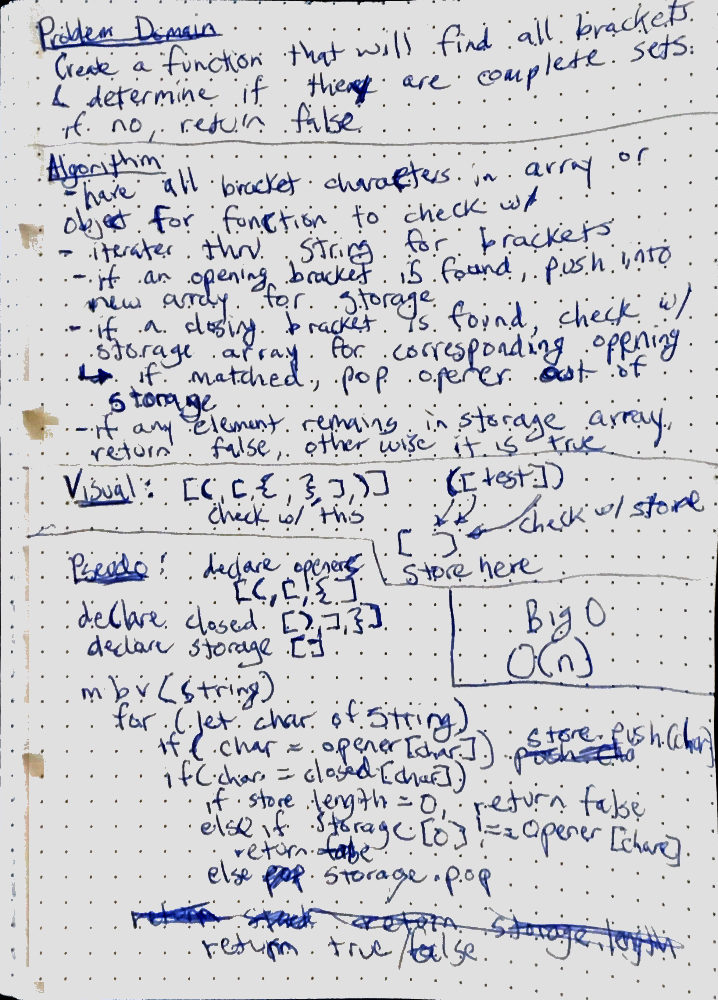

# Multi-bracket Validation
Create a function that will be able to determine if all brackets in the string are complete sets.  IE: {}, (), [].  This should return a boolean as its response.  If the first character is a closed bracket, it should return false.

## Challenge
- have an array or object for the function to look for brakcet characters
- loop through the passed string looking for the specified characters
- if an opening bracket is found, push into an array to keep track
- if a closing bracket is found, check with the array used in storage to see if a corresponding opening bracket is present
  - if one exists, pop the open bracket out of the array
- if anything is left in the storage array, then the string is not good and will be false.

## Solution
