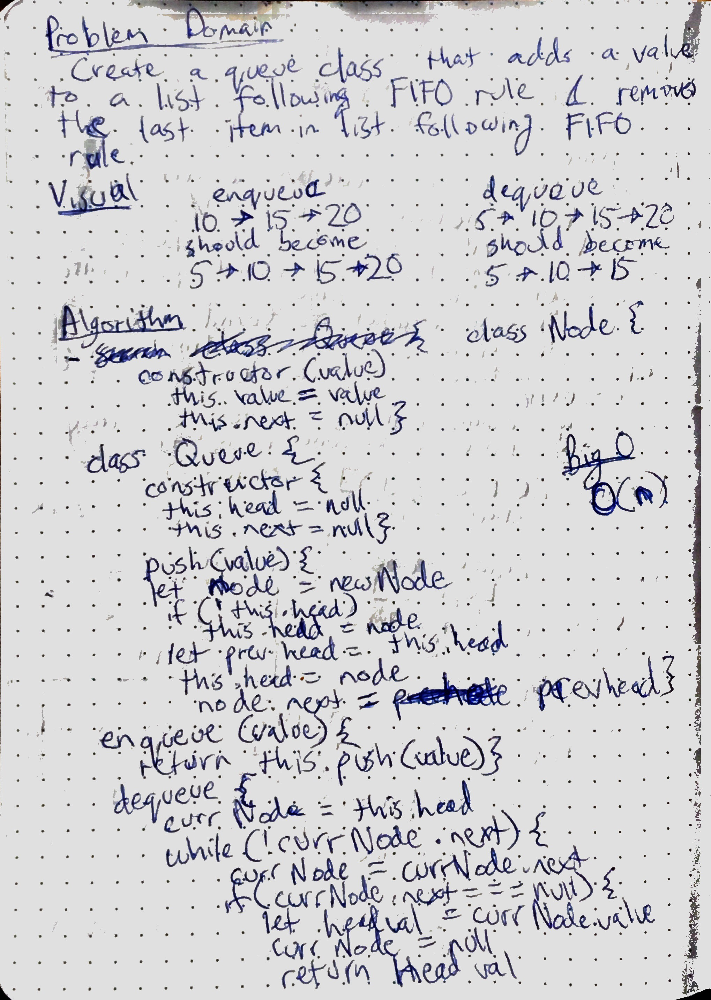

# Queues with Stacks
Create two methods for a queue that follows the enqueue and dequeue format/behavior.  Should behave with FIFO behavior.

## Challenge
- needs an enqueue function that does FIFO addition to an element
- needs a dequeue function that follows FIFO deletion to an element

## Solution
