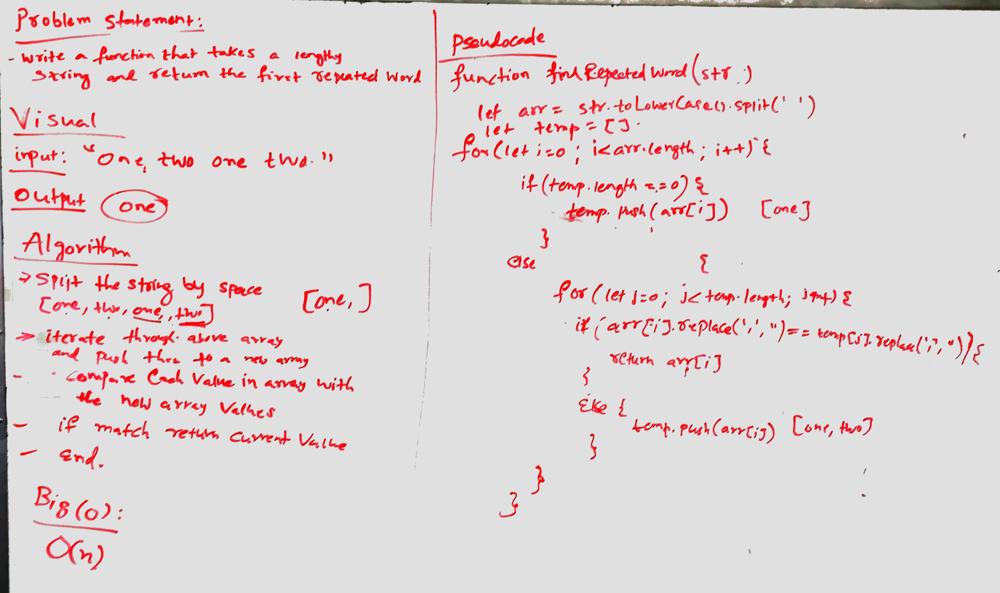

# Repeated Word
Create a function that will search a series of strings and return the first word that is repeated.

## Challenge
- change a string into an array
  - make sure all strings do not have punctuations
  - make sure all words are not case sensitive
- iterate through the list and save each unique word
- once a word is repeated, stop and return that word

## Solution
